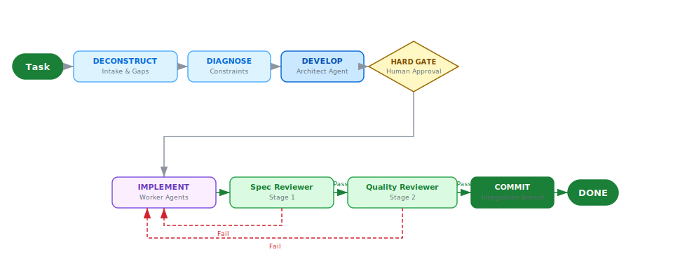

# Superpipelines: Multi-Agent Orchestration for OpenCode

Superpipelines transforms OpenCode from a chaotic generator into a disciplined engineering team. It enforces isolated code reviews and persists full pipeline state to JSON on every transition, so a mid-generation crash loses nothing.

[](https://www.npmjs.com/package/superpipelines)
[](https://www.npmjs.com/package/superpipelines)
[](./LICENSE)
[](https://github.com/gustavo-meilus/superpipelines-opencode/actions/workflows/ci.yml)

[](https://star-history.com/#gustavo-meilus/superpipelines-opencode&Date)

---

## Quick Start

Installing takes one command:

```bash
npm install -g superpipelines
```

Add the plugin entry to your `opencode.json`:

```json
{
  "$schema": "https://opencode.ai/config.json",
  "plugin": ["superpipelines"]
}
```

Then open an OpenCode session and run `/superpipelines:new-pipeline`. From there, the system walks through structured intake, generates a full specification document, pauses at the hard gate for human approval, and executes with fully isolated agents and automatic crash recovery.

---

## Architecture

<picture>
  <source media="(prefers-color-scheme: dark)" srcset="assets/architecture-dark.svg">
  
</picture>

Reviewer agents run with `disallowedTools: Write, Edit, Bash`. They cannot rationalize their way into fixing code; they can only pass or fail it.

---

## Execution Patterns

The framework selects the optimal pattern based on task complexity:

| Pattern | Shape | Use Case |
| :--- | :--- | :--- |
| **1: Sequential** | `A → B → C` | Ordered phases with hard data dependencies |
| **2: Parallel Fan-Out** | `A → [B, C, D] → Merge` | Independent branches that merge upon completion |
| **3: Iterative Loop** | `Implement → Test → Fix` | Test-driven repair with a hard cap of 3 iterations |
| **4: Human-Gated** | `Agent → Gate → Agent` | High-stakes stages requiring manual approval |
| **5: Spec-Driven Dev** | `Spec → Tasks → 2-Stage Review` | Full SDD with isolated worktrees per task |
| **6: 4D Wrapper** | `4D Intake → Any Pattern` | Wraps any pattern with structured deconstruction |

---

## Capabilities

Before a single line of code is written, every task is decomposed into a precise specification and a ranked implementation list. Dedicated reviewer agents then validate all output against that specification. Operating without write permissions, they are structurally incapable of rationalizing a fix rather than issuing a failure.

Pipeline state persists to scope-aware temp directories on every phase transition, so a crashed session resumes from the last completed step rather than discarding prior work. The state file is human-readable JSON. Opening it during a stuck run often shows exactly which phase stalled, which is worth knowing before restarting blindly. Hard-coded iteration caps hold at three cycles per loop, and mandatory human gates block execution at each high-stakes boundary, stopping hallucination spirals before they consume significant compute time.

---

## Slash Commands

| Command | Function |
| :--- | :--- |
| `/superpipelines:new-pipeline` | Initiates 4D intake and generates pipeline artifacts |
| `/superpipelines:run-pipeline` | Orchestrates an existing pipeline end-to-end |
| `/superpipelines:new-step` | Adds a new step to an existing named pipeline |
| `/superpipelines:update-step` | Modifies an existing step within a named pipeline |
| `/superpipelines:delete-step` | Removes a step from a named pipeline with gap analysis |
| `/superpipelines:audit-pipeline` | Audits agents and skills against the v2 compliance matrix |

---

## Installation

> Published on npm: [`superpipelines`](https://www.npmjs.com/package/superpipelines)

```bash
# Install globally from npm
npm install -g superpipelines
```

Or clone and build locally:

```bash
git clone https://github.com/gustavo-meilus/superpipelines-opencode.git
cd superpipelines-opencode
npm install
npm run build
```

Plugins specified via npm are automatically installed at startup using Bun and cached in `~/.cache/opencode/node_modules/`. Plugin source files can also be placed in `.opencode/plugins/` for project-level scope, or in `~/.config/opencode/plugins/` for global availability.

### Model Configuration

Superpipelines targets standard OpenCode Zen models (`opencode/big-pickle`) by default. To override the models used by native agents and generated pipelines, add a `superpipelines` block to `opencode.json`:

```json
{
  "plugin": ["superpipelines"],
  "superpipelines": {
    "models": {
      "default": "openai/gpt-4o",
      "architect": "anthropic/claude-3-5-sonnet-latest",
      "reviewer": "anthropic/claude-3-5-haiku-latest"
    }
  }
}
```

---

## Repository Layout

```
superpipelines-opencode/
├── package.json         # Plugin NPM package manifest
├── src/                 # TypeScript source code for the OpenCode plugin
├── dist/                # Compiled plugin code (run `npm run build`)
├── .opencode/           # Plugin installation guides
├── agents/              # Core agent definitions (Architect, Auditor, Executor, Reviewers)
├── skills/              # Shared skills (State, Paths, Patterns, Worktree Safety)
│   └── *-references/    # Deep reference libraries (on-demand loading)
├── commands/            # Slash command wrappers
└── settings.json        # Global plugin configuration
```

---

## Design Principles

Permission boundaries are enforced at the agent definition level, not through runtime policy that a model could argue its way around. Every agent declares a `permissionMode`, such as `acceptEdits` or `plan`. Bypassing that declaration requires explicit, documented justification in the agent configuration file, not a verbal override during a session. The architecture operates on the assumption that if a capability is accessible at runtime, a sufficiently motivated model will eventually invoke it.

Pipeline state persists to `<scope-root>/superpipelines/temp/{P}/{runId}/pipeline-state.json` at every phase transition. Resumption resets only in-progress phases, leaving completed work intact. High-density reference documentation lives in companion `*-references/` directories rather than the main prompt context, loading on demand so the working window stays clean for the actual task.

---

## Related Projects

The companion project [superpipelines](https://github.com/gustavo-meilus/superpipelines) handles standalone execution and external integrations outside the OpenCode plugin context. This plugin implements the OpenCode-side agent orchestration; the sibling project covers scheduling and state management outside the session boundary.

## Contributing

Contributions go through issues and pull requests at [gustavo-meilus/superpipelines-opencode](https://github.com/gustavo-meilus/superpipelines-opencode). Run `/superpipelines:audit-pipeline` to validate any addition against the compliance matrix before submitting.

## License

MIT. See [LICENSE](./LICENSE).
