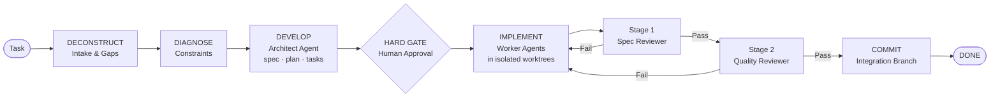

# Superpipelines — Multi-Agent Orchestration for OpenCode

Superpipelines transforms OpenCode from a chaotic generator into a disciplined engineering team. It enforces isolated code reviews, prevents infinite loops, and ensures you never lose state to a mid-generation crash via persistent JSON state files.

[](https://www.npmjs.com/package/superpipelines)
[](https://www.npmjs.com/package/superpipelines)
[](./LICENSE)
[](https://github.com/gustavo-meilus/superpipelines-opencode/actions/workflows/ci.yml)

[](https://star-history.com/#gustavo-meilus/superpipelines-opencode&Date)

---

## Quick Start

Get running in under a minute:

**1. Install**
```bash
npm install -g superpipelines
```

**2. Configure** — add to your `opencode.json`:
```json
{
  "$schema": "https://opencode.ai/config.json",
  "plugin": ["superpipelines"]
}
```

**3. Run**
```
/superpipelines:new-pipeline
```

That's it. Superpipelines will guide you through structured intake, generate a spec, wait for your approval, then execute with full review isolation and crash recovery.

---

## Architecture



> Reviewer agents run with `disallowedTools: Write, Edit, Bash` — they cannot rationalize their way into "fixing" code; they can only pass or fail it.

---

## Execution Patterns

The framework selects the optimal pattern based on task complexity:

| Pattern | Shape | Use Case |
| :--- | :--- | :--- |
| **1 — Sequential** | `A → B → C` | Ordered phases with hard data dependencies |
| **2 — Parallel Fan-Out** | `A → [B, C, D] → Merge` | Independent branches that merge upon completion |
| **3 — Iterative Loop** | `Implement → Test → Fix` | Test-driven repair with a hard cap of 3 iterations |
| **4 — Human-Gated** | `Agent → Gate → Agent` | High-stakes stages requiring manual approval |
| **5 — Spec-Driven Dev** | `Spec → Tasks → 2-Stage Review` | Full SDD with isolated worktrees per task |
| **6 — 4D Wrapper** | `4D Intake → Any Pattern` | Wraps any pattern with structured deconstruction |

---

## Capabilities

- **Deconstruction**: Tasks are decomposed into a precise specification, implementation plan, and itemized task list before a single line of code is written.
- **Write/Review Isolation**: Dedicated reviewer agents validate every task against the spec — they hold no write permissions, so they cannot rationalize changes.
- **State Persistence**: Pipeline state persists to scope-aware temp directories, enabling full crash recovery and mid-session resumption.
- **Escalation Guards**: Hard-coded iteration caps and mandatory human gates prevent model hallucination spirals and infinite loops.

---

## Slash Commands

| Command | Function |
| :--- | :--- |
| `/superpipelines:new-pipeline` | Initiates 4D intake and generates pipeline artifacts |
| `/superpipelines:run-pipeline` | Orchestrates an existing pipeline end-to-end |
| `/superpipelines:new-step` | Adds a new step to an existing named pipeline |
| `/superpipelines:update-step` | Modifies an existing step within a named pipeline |
| `/superpipelines:delete-step` | Removes a step from a named pipeline with gap analysis |
| `/superpipelines:audit-pipeline` | Audits agents and skills against the v2 compliance matrix |

---

## Installation

> **Published on npm**: [`superpipelines`](https://www.npmjs.com/package/superpipelines)

```bash
# Install globally from npm
npm install -g superpipelines
```

Or clone and build locally:

```bash
git clone https://github.com/gustavo-meilus/superpipelines-opencode.git
cd superpipelines-opencode
npm install
npm run build
```

Plugins specified via npm are automatically installed at startup using Bun and cached in `~/.cache/opencode/node_modules/`. You can also place plugin source files directly in:

- `.opencode/plugins/` — Project-level plugins
- `~/.config/opencode/plugins/` — Global plugins

### Model Configuration

By default, Superpipelines targets standard OpenCode Zen models (`opencode/big-pickle`). Override via your `opencode.json`:

```json
{
  "plugin": ["superpipelines"],
  "superpipelines": {
    "models": {
      "default": "openai/gpt-4o",
      "architect": "anthropic/claude-3-5-sonnet-latest",
      "reviewer": "anthropic/claude-3-5-haiku-latest"
    }
  }
}
```

---

## Repository Layout

```
superpipelines-opencode/
├── package.json         # Plugin NPM package manifest
├── src/                 # TypeScript source code for the OpenCode plugin
├── dist/                # Compiled plugin code (run `npm run build`)
├── .opencode/           # Plugin installation guides
├── agents/              # Core agent definitions (Architect, Auditor, Executor, Reviewers)
├── skills/              # Shared skills (State, Paths, Patterns, Worktree Safety)
│   └── *-references/    # Deep reference libraries (on-demand loading)
├── commands/            # Slash command wrappers
└── settings.json        # Global plugin configuration
```

---

## Design Principles

- **Structural Isolation**: Permission boundaries are enforced at the agent definition level. Reviewers cannot rationalize their way into "fixing" code; they can only fail it.
- **Scope-Aware State**: Pipeline state persists to `<scope-root>/superpipelines/temp/{P}/{runId}/pipeline-state.json`. Resumption resets in-progress phases while preserving completed work.
- **Permission Granularity**: Every agent declares a `permissionMode` (e.g., `acceptEdits`, `plan`). Bypassing permissions requires explicit, documented justification.
- **Progressive Disclosure**: High-density reference documentation resides in companion `*-references/` directories and is loaded on demand to minimize context bloat.

---

## Related Projects

- **[superpipelines](https://github.com/gustavo-meilus/superpipelines)** — The companion CLI service for managing Superpipelines runs, state, and schedules outside the OpenCode plugin context.

## Contributing

Contributions are managed via issues and PRs at [gustavo-meilus/superpipelines-opencode](https://github.com/gustavo-meilus/superpipelines-opencode). Use `/superpipelines:audit-pipeline` to validate additions against the compliance matrix before submission.

## License

MIT — See [LICENSE](./LICENSE).
