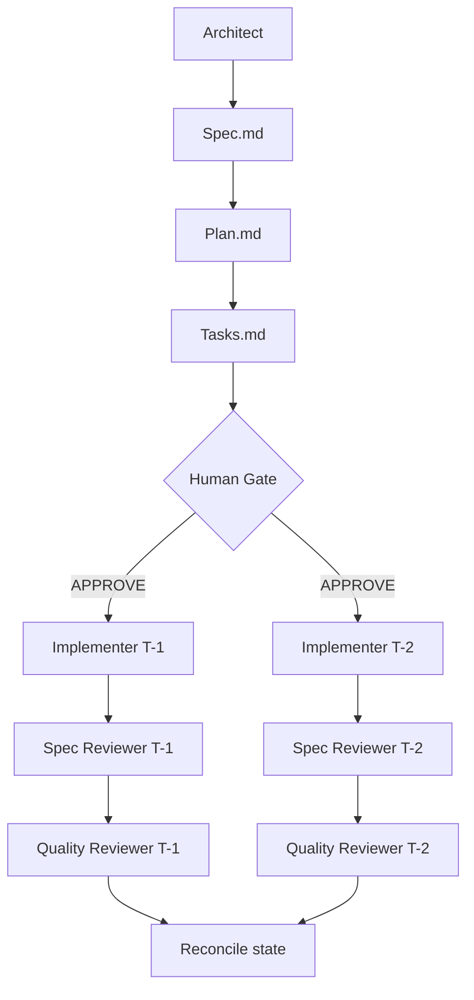

# Topology Selection — Architect Decision Guide

Used by `pipeline-architect` when choosing a pipeline pattern for a brief. Reads on demand; not preloaded.

## Decision tree

```
Is the task multi-step with dependencies between phases?
├── No → no pipeline; just apply the 4D Method and execute.
└── Yes
    ├── Sub-tasks independent and mergeable? → Pattern 2 / 2b (Parallel Fan-Out)
    ├── Fix/heal cycle (test → analyze → fix)? → Pattern 3 (Iterative Loop)
    ├── Destructive or irreversible action involved? → Pattern 4 (Human-Gated)
    ├── Feature requiring spec/plan/tasks? → Pattern 5 (SDD)
    └── Strictly linear, each phase depends on prior? → Pattern 1 (Sequential)
```

Pattern 6 (4D wrapper) always runs on top of any other pattern.

## Topology trade-offs

| Pattern | Latency | Token cost | Failure isolation | Human attention |
|---------|---------|------------|-------------------|-----------------|
| 1 | High (serial) | Low–medium | Per-phase rollback | Low |
| 2 / 2b | Low (parallel) | High (N concurrent) | Per-branch isolation | Medium |
| 3 | Variable | Medium per iteration | Loop bounded | Low until escalation |
| 4 | High (gated) | Low | Manual rollback | High at gates |
| 5 | Low (parallel implement) | High | Per-task isolation | Medium (1 gate) |

## Choosing handoff format

| Data shape | Handoff | Why |
|-----------|---------|-----|
| < 1 KB structured (status, JSON) | Pass content directly | Cheap; no file I/O cost |
| > 1 KB or any code | Pass file path | Avoids bloating spawn prompts |
| Per-task text from tasks.md | Extract once, pass extracted text to worker | Worker shouldn't have to find its own task |
| Logs / large datasets | Pass path + line range | Bound stdout + scope reads |

## Mermaid diagram template (deliverable)



## Context budget per pattern

Estimate before authoring. Budget = sum of agent body + preloaded skills + tool definitions + initial prompt.

| Pattern | Typical agents | Budget per agent | Total per pipeline |
|---------|----------------|------------------|--------------------|
| 1 | 3 sequential | 3–5k tokens | 9–15k |
| 2 | 3 parallel + 1 merge | 3–5k each | 12–20k |
| 3 | Tester + Analyzer + Fixer × N iterations | 4–6k each | 12–18k × N |
| 5 | Architect + N implementers + 2N reviewers | 4–6k each | 4–6k × (1 + 3N) |

Reasoning quality degrades around 40–60% context fill. Add up to 100k cap and prefer many small contexts over one large one (`ANT_SWARM_PRINCIPLE`).
