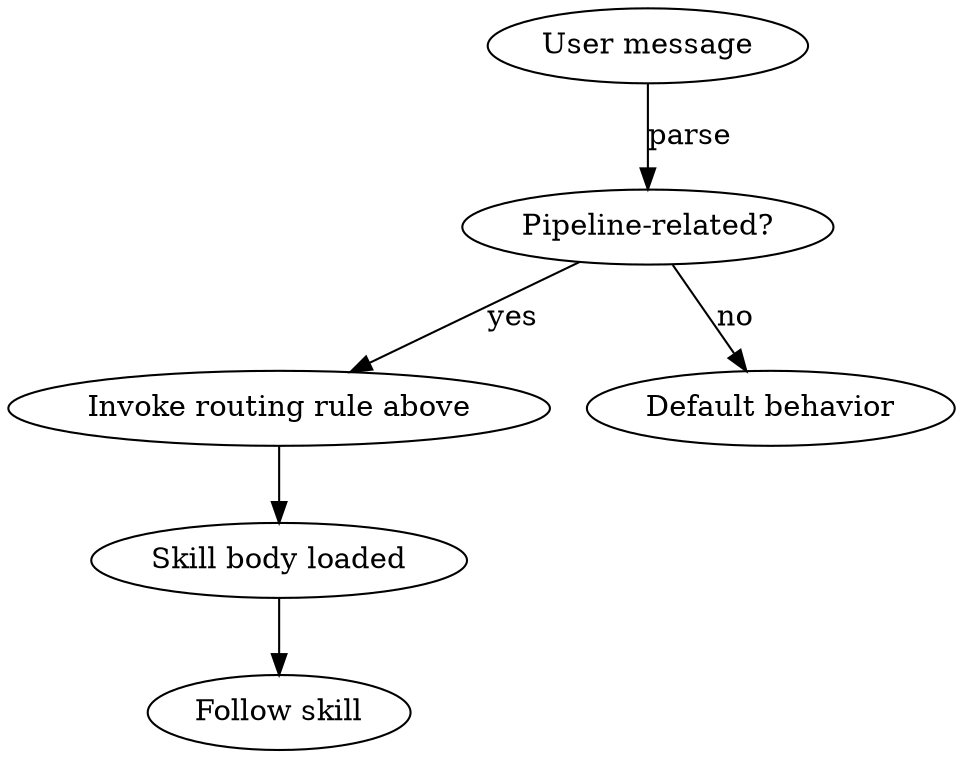

<SUBAGENT-STOP>
If dispatched as a subagent to execute a specific task, skip this skill. Subagents do not orchestrate; they perform a single role and exit with a status (DONE / DONE_WITH_CONCERNS / NEEDS_CONTEXT / BLOCKED).
</SUBAGENT-STOP>

<EXTREMELY-IMPORTANT>
If a pipeline skill applies to the user's request, invoke it. Do not rationalize past it.

Pipelines fail silently when skills are skipped — the agent believes it followed the workflow, but the body never loaded. Trust the routing rules below.
</EXTREMELY-IMPORTANT>

## What superpipelines is

A plugin for designing and running multi-agent AI pipelines under the conventions in `${CLAUDE_PLUGIN_ROOT}/docs/AI_PIPELINES_LLM.md` (Patterns 1–6, write/review isolation, worktree safety, spec-driven development, 4D Method).

## Instruction priority

1. User's explicit instructions (CLAUDE.md / GEMINI.md / AGENTS.md / direct messages) — highest.
2. Superpipelines skills — override default behavior where they conflict.
3. Default system prompt — lowest.

If the user says "skip the spec phase," follow the user. The user is in control.

## How to access skills on this harness

| Harness | Mechanism |
|---------|-----------|
| Claude Code | `Skill` tool — invoke skill, follow its content. Never `Read` a SKILL.md directly. |
| Cursor | `Skill` tool — same as Claude Code. |
| Copilot CLI | `skill` tool — auto-discovers from installed plugins. |
| Codex CLI/App | `skill` tool — same as Copilot CLI. |
| OpenCode | Skills are bootstrap-loaded; reference by name. |
| Gemini CLI | `activate_skill` tool — metadata loads at session start, body activates on demand. |

For tool-name mapping on non-Claude-Code harnesses, see `references/cursor-tools.md`, `references/codex-tools.md`, `references/copilot-tools.md`, `references/gemini-tools.md`, `references/opencode-tools.md`.

## Routing rules — when to invoke which skill

| User says / situation | Skill to invoke |
|-----------------------|-----------------|
| "Design a pipeline that…" / "Build me a workflow for…" | `creating-a-pipeline` |
| "Run the pipeline" / "Execute tasks.md" / `tasks.md` exists | `running-a-pipeline` |
| "Audit this pipeline" / "Review my agent definitions" | dispatch `pipeline-auditor` subagent (Claude Code) or invoke audit skill |
| "Create a new agent" | dispatch `pipeline-architect` subagent in single-agent mode |
| "Create a new skill" | dispatch `skill-architect` subagent |
| Ambiguous request before any pipeline work | run the 4D Method internally — load `sk-4d-method` |
| About to start multi-step feature work | load `sk-spec-driven-development` |
| About to author or modify an agent / skill | load `sk-claude-code-conventions` |
| Choosing an execution pattern | load `sk-pipeline-patterns` |

The detailed checklist is in `references/skill-routing.md`.

## Capability tiers per harness

| Tier | Harnesses | What works |
|------|-----------|------------|
| Tier 1 | Claude Code | Skills + subagents (`agents/`) + slash commands + hooks. Full pipeline orchestration with real subagent dispatch. |
| Tier 2 | Cursor | Skills + slash via natural language + Cursor SessionStart hook. No subagents — `running-a-pipeline` falls back to in-session role-play. |
| Tier 3 | Codex, OpenCode, Copilot CLI, Gemini | Skills only. Slash commands invoked via natural language. No hooks (bootstrap is via `AGENTS.md` / `GEMINI.md` / `.opencode/INSTALL.md`). `running-a-pipeline` runs all roles in one session, role-played, with the same status protocol. |

On Tier 2/3, when the workflow says "dispatch subagent X," the active session role-plays X with a fresh mental context: read the agent's body from `agents/X.md`, follow its rules, emit one terminal status.

## The Rule

Invoke relevant or requested skills BEFORE any response or action. Even a 1% chance a pipeline skill applies = invoke and check. If wrong, drop it.

## Pipeline invariants (memorize)

- `SUB_AGENT_SPAWNING: FALSE` — Subagents don't spawn children. Orchestration lives at the parent session / top-level skill.
- `WRITE_REVIEW_ISOLATION: TRUE` — The agent that writes never reviews. Stage 1 (spec compliance) gates Stage 2 (code quality).
- `MODEL_SELECTION: SONNET_ONLY` — Every agent is `model: sonnet`. Scale via `effort:`.
- Agents emit exactly one of `DONE / DONE_WITH_CONCERNS / NEEDS_CONTEXT / BLOCKED` before exiting.
- Pipeline state lives in `tmp/pipeline-state.json` (workspace-relative, not plugin-relative).

## Common mistakes

- Reading a SKILL.md with `Read` instead of invoking via `Skill` tool — body still loads, but discovery and caching break.
- Dispatching Stage 2 review without Stage 1 passing — over-build is a Stage 1 failure, not Stage 2.
- Letting an iterative loop run forever — hard cap at 3 iterations without measurable progress.
- Treating `creating-a-pipeline` as optional for vague requests — that's where 4D resolves the ambiguity.
- Storing pipeline state under `${CLAUDE_PLUGIN_ROOT}` — wiped on plugin update. Always under workspace `tmp/`.

## Red Flags — STOP

- "I already know what the pipeline should do, skip the spec" → run `creating-a-pipeline` anyway. The spec is the contract that lets parallel workers stay in sync.
- "One more iteration should fix it" (after 2+ failures with new failures in new locations) → STOP. Escalate per Pattern 3.
- "The reviewer agent and the executor can be the same" → NO. `WRITE_REVIEW_ISOLATION: TRUE` is non-negotiable.
- "I'll skip the worktree, it's just a small change" → if Pattern 2/2b/3/5 selected, worktree is required. Run the 4-step protocol from `sk-worktree-safety`.
